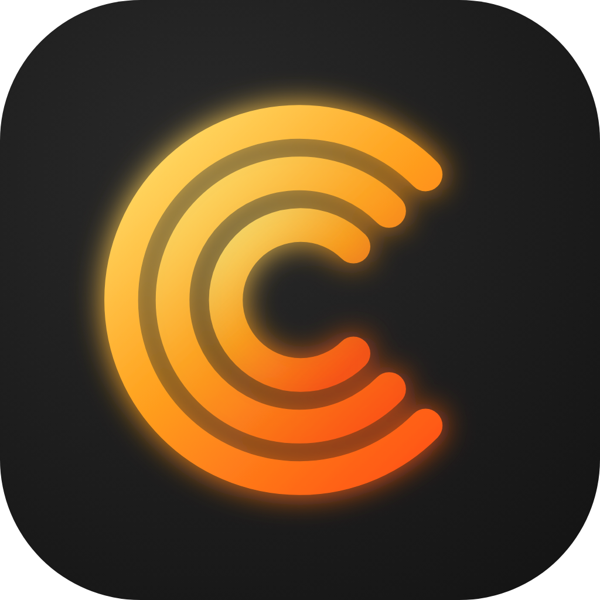
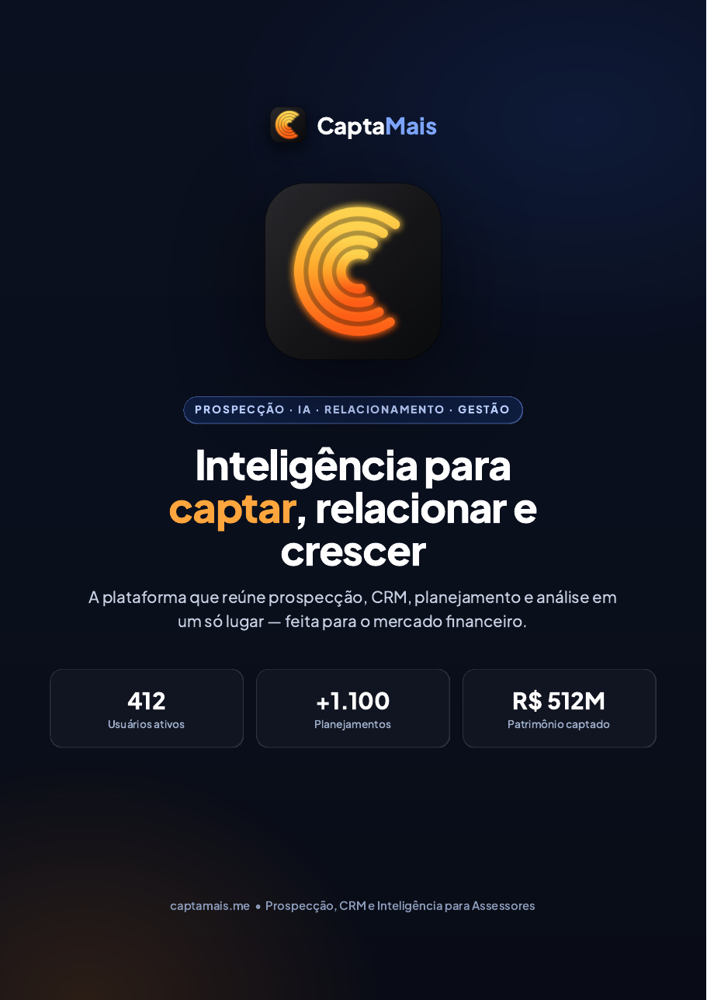
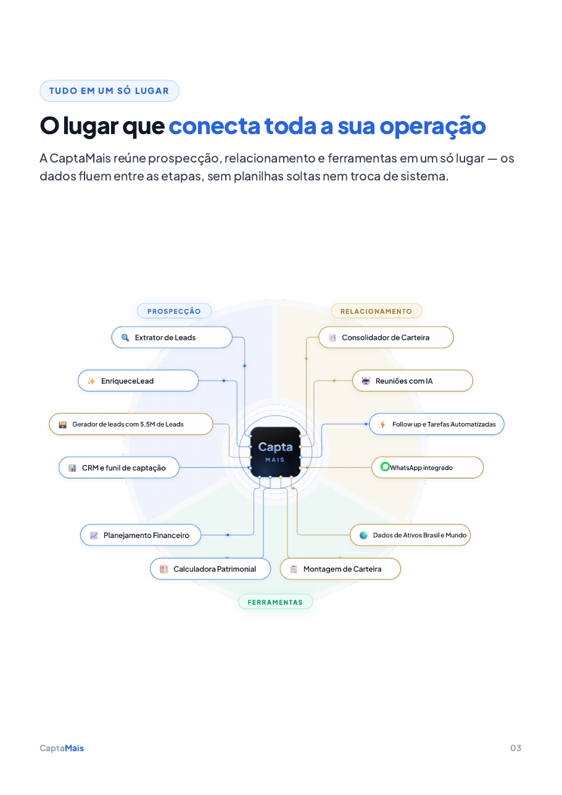
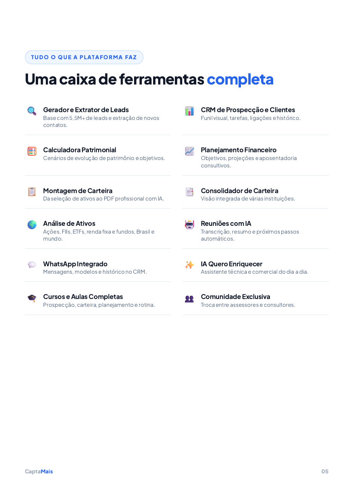

<p align="center">
  
</p>

<h1 align="center">CaptaMais local — Skill e MCP</h1>

<p align="center">
  <strong>Seu CRM de prospecção no seu computador.</strong><br>
  Uma solução da <strong>Capita+®</strong> para usar com Claude, Cursor e outros assistentes.
</p>

<p align="center">
  <a href="https://captamais.me"><strong>Conhecer a plataforma</strong></a> ·
  <a href="docs/apresentacao-capta-mais.pdf"><strong>Abrir apresentação</strong></a> ·
  <a href="https://github.com/Tasca2/captamais-local/raw/main/docs/apresentacao-capta-mais.pdf"><strong>Baixar PDF</strong></a>
</p>

**Versão 1.02** (metadados npm: `1.0.2`).

Os dados dos seus leads ficam **na sua máquina**. Recursos de IA (opcional) passam pela nuvem [CaptaMais](https://captamais.me) e seguem as políticas oficiais da plataforma.

| Pasta | Para quê |
|---|---|
| [`captamais-skill/`](captamais-skill/) | Skill do Claude (`/captamais`) — funil, leads, agenda |
| [`captamais-mcp/`](captamais-mcp/) | Servidor MCP — Cursor, Claude Desktop e outros clientes |

## Conheça o ecossistema CaptaMais

Da prospecção ao relacionamento e às ferramentas de apoio, o CaptaMais conecta a operação comercial
em um só lugar. Veja alguns destaques da apresentação institucional:

<p align="center">
  <a href="docs/apresentacao-capta-mais.pdf"></a>
  <a href="docs/apresentacao-capta-mais.pdf"></a>
  <a href="docs/apresentacao-capta-mais.pdf"></a>
</p>

<p align="center">
  <a href="docs/apresentacao-capta-mais.pdf"><strong>📖 Abrir a apresentação completa</strong></a> ·
  <a href="https://github.com/Tasca2/captamais-local/raw/main/docs/apresentacao-capta-mais.pdf"><strong>⬇️ Baixar em PDF</strong></a>
</p>

**Copyright © 2026 Henrique Tasca Tedesco.** Todos os direitos reservados.  
Capita+® é uma marca registrada. CaptaMais — [captamais.me](https://captamais.me)

---

## Antes de começar

1. Conta no [CaptaMais](https://captamais.me) (para vincular a nuvem; o CRM local funciona sem isso).
2. [Node.js 18 ou superior](https://nodejs.org/) instalado (na instalação, marque a opção de adicionar ao PATH).
3. Claude Desktop (skill) e/ou Cursor / outro cliente MCP.

Ao usar a nuvem CaptaMais, você concorda com:

- [Termos de uso](https://captamais.me/termos)
- [Política de privacidade (LGPD)](https://captamais.me/privacidade)
- [Acordo de tratamento de dados — DPA](https://captamais.me/dpa)

No CRM só local, os leads não saem do seu PC. Veja também a [privacidade desta skill](captamais-skill/PRIVACY.md).

---

## 1. Baixar

**Jeito mais simples (sem Git):**

1. Abra [github.com/Tasca2/captamais-local](https://github.com/Tasca2/captamais-local).
2. Clique em **Code** → **Download ZIP**.
3. Extraia o ZIP, por exemplo em `Documentos\CaptaMais-local`.
4. Dentro da pasta extraída você verá `captamais-skill` e `captamais-mcp`.

**Quem usa Git:**

```powershell
git clone https://github.com/Tasca2/captamais-local.git
```

---

## 2. Instalar a skill (Claude)

No PowerShell (Windows), ajuste o caminho se você extraiu o ZIP em outro lugar:

```powershell
$origem = "$env:USERPROFILE\Documents\CaptaMais-local\captamais-skill"
New-Item -ItemType Directory -Force -Path "$env:USERPROFILE\.claude\skills" | Out-Null
Copy-Item -Recurse -Force $origem "$env:USERPROFILE\.claude\skills\captamais"
cd "$env:USERPROFILE\.claude\skills\captamais"
npm install
```

No Mac / Linux:

```bash
mkdir -p ~/.claude/skills
cp -R captamais-skill ~/.claude/skills/captamais
cd ~/.claude/skills/captamais
npm install
```

Reinicie o Claude Desktop. Peça **"abre meu CRM"** ou use `/captamais`.

---

## 3. Instalar o MCP (Cursor ou Claude Desktop)

No PowerShell, na pasta extraída:

```powershell
cd captamais-mcp
npm install
npm run build
```

Anote o caminho completo de `dist\index.js` (exemplo: `C:\Users\SeuNome\Documents\CaptaMais-local\captamais-mcp\dist\index.js`).

### Vincular sua conta CaptaMais

1. Entre em [captamais.me](https://captamais.me) e faça login.
2. Abra **Minha Conta → Conector**.
3. Gere a chave e copie (ela aparece **uma vez**).
4. Cole no cliente, como abaixo. **Não compartilhe essa chave.**

### Cursor

Em **Settings → MCP**, adicione um servidor:

- comando: `node`
- argumento: o caminho de `dist\index.js`
- variáveis:
  - `CAPTAMAIS_API_KEY` = sua chave
  - `CAPTAMAIS_CLOUD_URL` = `https://captamais.me`

### Claude Desktop

Edite o arquivo de configuração MCP e inclua:

```json
{
  "mcpServers": {
    "captamais": {
      "command": "node",
      "args": ["C:/Users/SeuNome/Documents/CaptaMais-local/captamais-mcp/dist/index.js"],
      "env": {
        "CAPTAMAIS_API_KEY": "cole-sua-chave-aqui",
        "CAPTAMAIS_CLOUD_URL": "https://captamais.me"
      }
    }
  }
}
```

Reinicie o cliente. Sem a chave, o CRM local funciona; só a IA da nuvem fica indisponível.

---

## Políticas, privacidade e LGPD

O CaptaMais trata dados em dois papéis, descritos na política oficial:

| Situação | Papel |
|---|---|
| Seu cadastro, login e uso da plataforma | CaptaMais é **controlador** |
| Leads e clientes que você cadastra | **Você** é o controlador; o CaptaMais só opera na nuvem quando você pede um recurso (IA, etc.) |

Documentos oficiais (fonte única, versão vigente no site):

| Documento | URL |
|---|---|
| Termos de uso | https://captamais.me/termos |
| Política de privacidade (LGPD) | https://captamais.me/privacidade |
| Acordo de tratamento de dados (DPA) | https://captamais.me/dpa |

Textos complementares deste repositório (skill local): [PRIVACY.md](captamais-skill/PRIVACY.md), [DISCLAIMER.md](captamais-skill/DISCLAIMER.md), [SECURITY.md](captamais-skill/SECURITY.md). Em caso de divergência, **valem os documentos do site**.

Encarregado / contato: [contato@henriquetasca.com.br](mailto:contato@henriquetasca.com.br)

---

## Direitos autorais

```
Copyright © 2026 Henrique Tasca Tedesco.
CaptaMais — https://captamais.me
Todos os direitos reservados.
```

O código deste repositório é **source-available**: você pode baixar e usar na sua máquina. Não pode republicar, revender nem usar para copiar a plataforma. Licença completa: [LICENSE](LICENSE).

Capita+® é uma marca registrada de Henrique Tasca Tedesco. A marca, a identidade visual e a
plataforma CaptaMais pertencem a Henrique Tasca Tedesco.

---

## Suporte

- Plataforma e conta: [captamais.me](https://captamais.me)
- E-mail: [contato@henriquetasca.com.br](mailto:contato@henriquetasca.com.br)
- Falha de segurança: não abra issue pública — escreva para o e-mail acima (veja [SECURITY.md](captamais-skill/SECURITY.md)).
