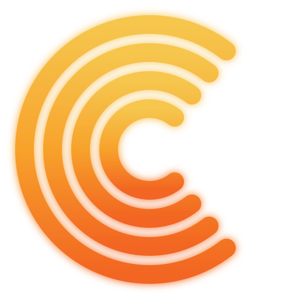

<p align="center">
  
</p>

<h1 align="center">CaptaMais — CRM local no Claude</h1>

<p align="center">
  Seu CRM de prospecção rodando <b>na sua máquina</b>, operado pelo seu assistente de IA.<br/>
  Os dados dos seus leads ficam <b>no seu computador</b> — privacidade em primeiro lugar.
</p>

<p align="center">
  
  
  
  
</p>

---

## Sumário
- [O que é](#o-que-é)
- [Por que usar](#por-que-usar)
- [Recursos](#recursos)
- [Requisitos](#requisitos)
- [Instalação](#instalação)
- [Como usar](#como-usar)
- [Privacidade e segurança](#privacidade-e-segurança)
- [Integração com a plataforma](#integração-com-a-plataforma)
- [Roadmap](#roadmap)
- [Suporte](#suporte)
- [Licença e avisos legais](#licença-e-avisos-legais)

## O que é
A **CaptaMais Skill** transforma o seu assistente de IA (Claude e clientes compatíveis) em um **CRM de
prospecção que roda localmente**. Você gerencia leads e o funil, marca **ligações, follow-ups e
reuniões (com Google Meet)** e acompanha sua **agenda** — tudo com os dados **na sua máquina**.
Recursos avançados (IA, dados de mercado, montagem de carteira) conectam-se à nuvem CaptaMais **quando
você quiser**, e são cobrados por uso.

> A skill é **local-first**: CRM e interface rodam no seu PC. Recursos avançados e a cobrança
> ficam na nuvem CaptaMais. Veja [`INTEGRATION.md`](INTEGRATION.md).

## Por que usar
- 🔒 **Privacidade real:** os dados dos leads não saem do seu computador por padrão.
- 🧠 **IA quando você quiser:** prepare reuniões pela nuvem CaptaMais (medida na sua conta).
- 💸 **Pague pelo que usar:** CRM local é grátis; só os recursos de nuvem são medidos.

## Recursos
**Local (grátis, sem nuvem):**
- Funil de prospecção (NOVO LEAD → CONTATO INICIAL → PRIMEIRA REUNIÃO → SEGUNDA REUNIÃO → FECHAMENTO).
- Criar lead, **arrastar cards** entre etapas, **pop-up** para editar e atender.
- Atividades: **ligação, follow-up, reunião (+ Meet), tarefa** e **agenda**.
- **Importar/Exportar** (JSON).

**Nuvem (opcional, medido — liberação progressiva):**
- IA para preparar reunião (nuvem CaptaMais).
- Dados de ativos, montagem de carteira, enriquecimento, sincronização. Ver [status](INTEGRATION.md#status-dos-recursos).

## Requisitos
- **Node.js 18+**
- Um cliente de IA compatível (ex.: Claude Desktop) — a skill vai na sua pasta de skills.
- (Opcional) Conta CaptaMais para os recursos de nuvem.

## Instalação
```bash
# 1) Baixe o repositório (skill + MCP) e copie a skill para o Claude
git clone https://github.com/Tasca2/captamais-local.git
cp -R captamais-local/captamais-skill ~/.claude/skills/captamais

# 2) Instale a dependência local (uma vez)
cd ~/.claude/skills/captamais
npm install
```
> Windows: a pasta costuma ser `%USERPROFILE%\.claude\skills\`.

## Como usar
No Claude, chame:
```
/captamais
```
…ou peça em linguagem natural: **"abre meu CRM"**, **"cria um lead"**, **"marca uma reunião com o
lead 3 e cria o Meet"**, **"o que tenho na agenda?"**.

O Claude **sobe o app local** (`http://127.0.0.1:…`, só na sua máquina) e abre no navegador. A partir
daí você trabalha direto: arrastar cards, criar/editar leads, registrar atendimento, agenda,
importar/exportar.

## Privacidade e segurança
- Servidor local escuta **só em `127.0.0.1`** + **token anti-CSRF**; nada exposto na rede.
- Dados dos leads ficam em `~/.captamais/captamais.db` (**sua máquina**).
- Você é o **controlador** dos dados dos seus leads (LGPD/GDPR). Detalhes: [`PRIVACY.md`](PRIVACY.md).
- Modelo de segurança, **riscos a conhecer** e como reportar falhas: [`SECURITY.md`](SECURITY.md).
- 💡 Recomendação: mantenha a **cifra de disco** ativa (BitLocker/FileVault) no seu computador.

## Integração com a plataforma
Como vincular a conta, o que é medido e o que sai da máquina: [`INTEGRATION.md`](INTEGRATION.md).

Documentos oficiais do CaptaMais (valem sobre qualquer texto deste repositório):
- [Termos de uso](https://captamais.me/termos)
- [Política de privacidade (LGPD)](https://captamais.me/privacidade)
- [DPA — acordo de tratamento de dados](https://captamais.me/dpa)

## Suporte
[contato@henriquetasca.com.br](mailto:contato@henriquetasca.com.br) · [captamais.me](https://captamais.me)  
Falhas de segurança: [`SECURITY.md`](SECURITY.md) (não abra issue pública).

## Licença e avisos legais
**Copyright © 2026 Henrique Tasca Tedesco.** Todos os direitos reservados.

- Licença: [`LICENSE`](LICENSE)
- Avisos: [`DISCLAIMER.md`](DISCLAIMER.md)

<p align="center"><sub>© 2026 Henrique Tasca Tedesco · CaptaMais · captamais.me</sub></p>
